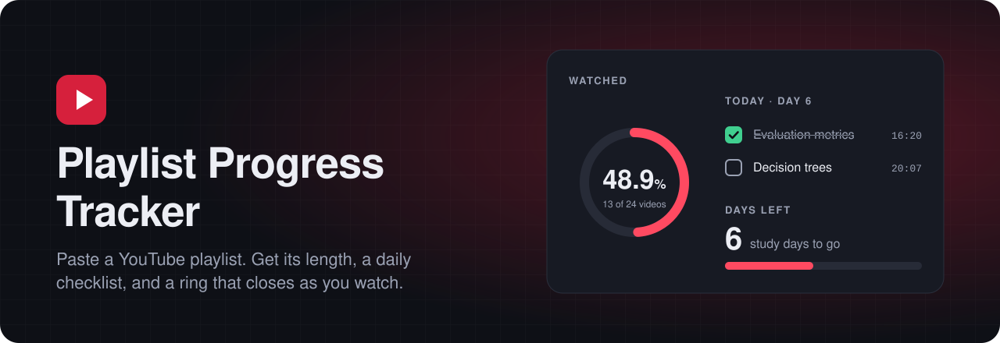
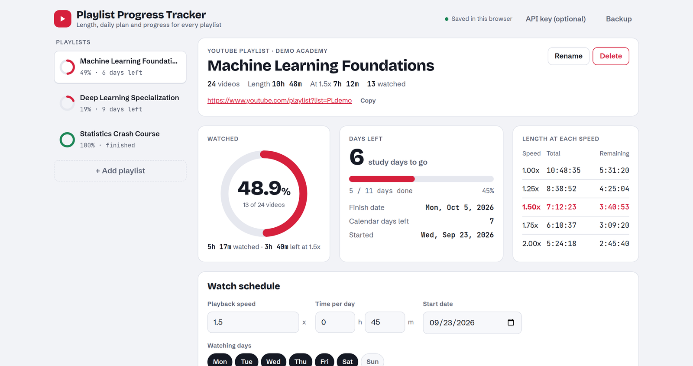
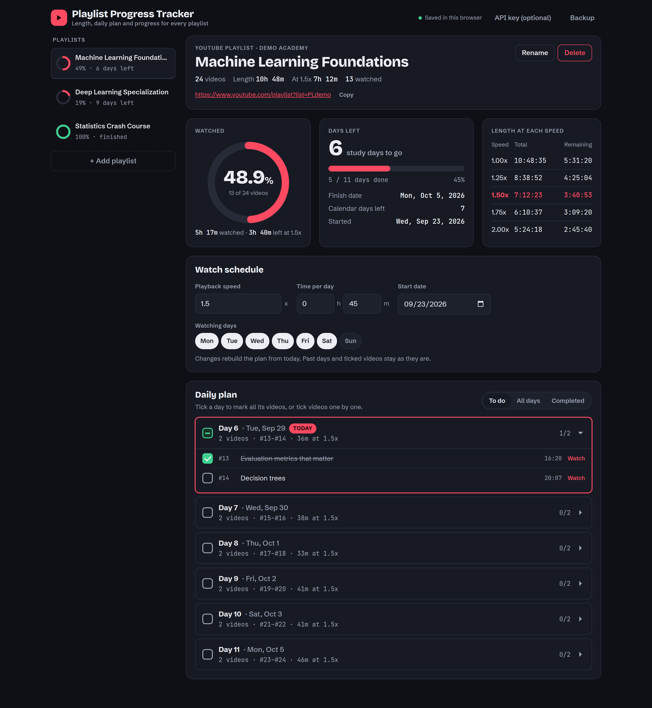
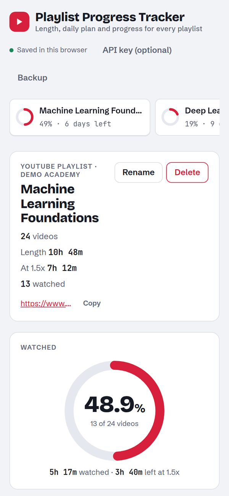
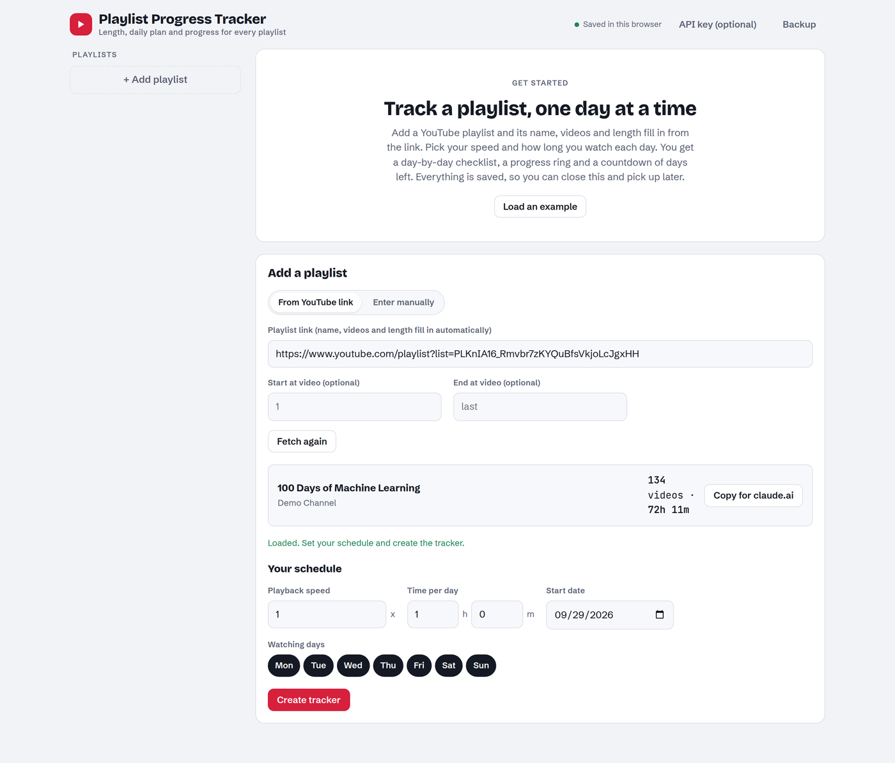
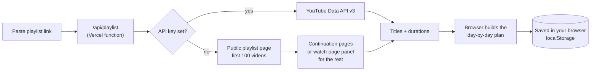

<p align="center">
  
</p>

<p align="center">
  <a href="https://playlist-progress-tracker-lime.vercel.app"></a>
  
  
  <a href="LICENSE"></a>
</p>

<p align="center">
  <a href="https://playlist-progress-tracker-lime.vercel.app"><b>Open the app</b></a> ·
  <a href="#features">Features</a> ·
  <a href="#how-it-works">How it works</a> ·
  <a href="#run-it-locally">Run locally</a> ·
  <a href="#deploy-your-own">Deploy your own</a>
</p>

---

Long YouTube courses are easy to start and hard to finish. **Playlist Progress Tracker** turns any public playlist into a study plan: paste the link, choose your playback speed and how much time you have each day, and get a dated, day-by-day checklist of the actual videos. A progress ring fills up as you tick videos off, and a countdown tells you how many study days are left.

<p align="center">
  
</p>

## Features

| | |
|---|---|
| **Paste a link, get the details** | Name, number of videos and total length fill in automatically from the playlist link. Works with `playlist?list=` and `watch?v=…&list=` links. No API key needed. |
| **Day-by-day checklist** | Videos are split into days that fit your daily time at your chosen speed. Tick a whole day or single videos, and jump to any video with a **Watch** link. |
| **Progress ring** | Shows the percentage watched in the centre and closes as you go. It turns green when you finish. |
| **Days-left countdown** | A progress bar of study days done, the finish date, and calendar days left. |
| **Falls behind? Reschedule** | Missed days are flagged, and one click rebuilds the rest of the plan from today without touching what you've already ticked. |
| **Length at every speed** | Total and remaining time at 1x, 1.25x, 1.5x, 1.75x, 2x and your own speed. |
| **Your schedule** | Pick watching days (say, weekdays only), minutes per day, start date and a video range such as 10–50. |
| **Many playlists** | Each playlist keeps its own plan and progress, with a mini ring in the sidebar. |
| **Private by design** | Progress is saved in your own browser. Nothing is stored on a server. Backup/Import moves it between devices. |
| **Light and dark, phone and desktop** | Follows your system theme and works at any screen size. |

## Screenshots

<table>
  <tr>
    <td width="68%"></td>
    <td width="32%"></td>
  </tr>
  <tr>
    <td align="center"><sub>Dark theme</sub></td>
    <td align="center"><sub>On a phone</sub></td>
  </tr>
</table>

<p align="center">
  <br>
  <sub>Paste a link and the playlist loads: here all 134 videos of a long course.</sub>
</p>

## How it works



**Reading the playlist.** The serverless function in [`api/playlist.js`](api/playlist.js) reads the public playlist page, which lists the first 100 videos. It fetches the rest through YouTube's continuation pages, or through the playlist panel on the watch page when a playlist doesn't offer continuations. If a `YOUTUBE_API_KEY` is configured, the official Data API is tried first.

**Building the plan.** Your daily budget is `minutes per day × playback speed` of video time. Videos are placed in order into each watching day until the next one would push the day more than 10% over budget. A video longer than a whole day gets a day to itself. Rescheduling keeps completed past days as they are and re-plans everything unwatched from today.

## Privacy

Your playlists, ticks and schedule live in your browser's `localStorage`. The server only receives the playlist ID so it can look up titles and lengths, and it doesn't store it. Other people who open the app get their own empty tracker. Use **Backup** to keep a copy or move your progress to another device.

## Run it locally

No dependencies, just Node.js 18 or newer.

```bash
git clone https://github.com/shaurya269/playlist-progress-tracker.git
cd playlist-progress-tracker
npm run dev
```

Open http://localhost:3000. The dev server serves the app and runs the same `/api/playlist` function Vercel does.

## Deploy your own

[](https://vercel.com/new/clone?repository-url=https%3A%2F%2Fgithub.com%2Fshaurya269%2Fplaylist-progress-tracker&project-name=playlist-progress-tracker)

That's it: no build step and no settings needed. Optionally add a `YOUTUBE_API_KEY` environment variable (a free YouTube Data API v3 key from Google Cloud Console) to use the official API first.

## API

```http
GET /api/playlist?id=PLAYLIST_ID
```

```json
{
  "title": "100 Days of Machine Learning",
  "channel": "CampusX",
  "videos": [["Video title", 1523, "videoId"], ["…", 948, "…"]],
  "total": 134,
  "skipped": 0,
  "partial": false,
  "source": "page"
}
```

Each video is `[title, seconds, videoId]`. Private and deleted videos are skipped and counted in `skipped`. `partial` is `true` if YouTube returned fewer videos than the playlist lists.

## Project structure

```
├── index.html            App markup and styles
├── app.js                App logic: planning, checklist, progress, storage
├── api/
│   └── playlist.js       Vercel serverless function that reads a playlist
├── scripts/
│   └── dev-server.js     Zero-dependency local server (npm run dev)
├── docs/                 Banner and screenshots for this README
├── vercel.json           Function timeout and security headers
└── .github/              CI workflow and issue templates
```

## Tech stack

Plain HTML, CSS and JavaScript on the front end, with no framework or build step. One Node.js serverless function on [Vercel](https://vercel.com). Fonts are Bricolage Grotesque, Schibsted Grotesk and JetBrains Mono.

## Roadmap

- [ ] Optional sign-in to sync progress across devices
- [ ] Notes and timestamps per video
- [ ] Export the plan to Google Calendar (.ics)
- [ ] Streaks and weekly stats

Ideas and bug reports are welcome in [Issues](https://github.com/shaurya269/playlist-progress-tracker/issues).

## Credits

Inspired by [ytplaylist-len](https://github.com/sharatsachin/ytplaylist-len) by Sharat Sachin, a great tool for finding a playlist's length. This project adds a day-by-day plan, checklists and progress tracking on top of that idea.

## License

[MIT](LICENSE) © 2026 [Shaurya Sorayan](https://github.com/shaurya269)
